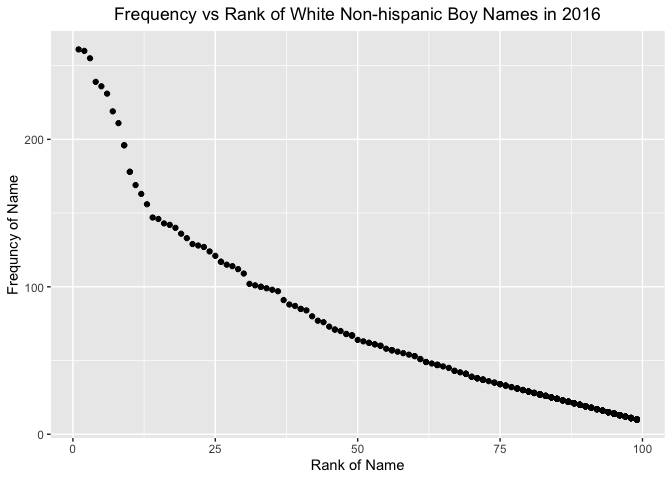

p8105\_hw2\_rs4025
================
Rebecca Silva
10/4/2019

Questions: - best way to print var names? I did names() - do we have to
specify col\_types or can we let R do that - convert month abrrev to
full month - make year as.numeric? - order years in ascending?

## Problem 1

``` r
# dumpster data 
data_trash = 
  readxl::read_excel("./data/HealthyHarborWaterWheelTotals2018-7-28.xlsx", 
                          sheet = 1,
                          range = "A2:N338") %>%
  janitor::clean_names() %>%
  filter( dumpster != "NA") %>% 
  mutate( sports_balls = as.integer(
    round(sports_balls)))

# precipitation 2017
data_precip2017 = 
  readxl::read_excel("./data/HealthyHarborWaterWheelTotals2018-7-28.xlsx", 
                          sheet = 4,
                          range = "A2:B14") %>% 
  janitor::clean_names() %>%
  mutate( year = 2017)

# precipitation 2018
data_precip2018 = 
  readxl::read_excel("./data/HealthyHarborWaterWheelTotals2018-7-28.xlsx", 
                          sheet = 3,
                          range = "A2:B14") %>% 
  janitor::clean_names() %>%
  mutate( year = 2018)
```

``` r
# combine 2017 and 2018 data  (join or bind?)
data_precip = 
  bind_rows(data_precip2017, data_precip2018) %>%
  janitor::clean_names() %>% 
  mutate( month = str_to_lower( month.name[month] )) %>% 
  select( year, month, total)
```

``` r
# total precip in 2018
total_precip = 
  data_precip %>%
  filter( year == 2018) %>% 
  summarize( total = sum(total, na.rm = T))

# median number of sports balls in a dumpster in 2017
median = 
  data_trash %>% 
  filter( year == 2017) %>% 
  summarize( median = median(sports_balls, na.rm = T))
```

The data set named ‘data\_trash’ gives information about trash disposal
in specified dumpsters. The data set has 285 observations and 14
variables. Some key variables include the dumpster number, the date the
trash is collected, and how much the trash weighs which are named
dumpster, date, and weight\_tons, respectively. Many of the variables
consist of frequent types of trash collected such as plastic\_bottles,
cigarette\_butts and grocery\_bags. The median number of sports balls in
a dumpster is 8.

The data set named ‘data\_precip’ gives information about the total
precipitation in inches in 2017 and 2018 for each month. There are 24
observations and 3 variables, which are year, month and total. The total
precipitation in 2018 is 23.5 inches.

## Problem 2

``` r
# pols data
pols = 
  read_csv("./data/fivethirtyeight_datasets/pols-month.csv") %>% 
  separate(mon, 
           into = c("year", "month", "day"), 
           sep = "-") %>% 
  mutate( month = str_to_lower(month.name[as.numeric(month)]),
          year = as.numeric(year)) %>% 
  pivot_longer(c(prez_gop, prez_dem), 
               names_to = "president", 
               names_prefix = "prez_", 
               values_to = "logical") %>%
  mutate( logical = replace( logical, logical == 2, 1)) %>% 
  select( - day)
```

``` r
# snp data
snp = 
  read_csv("./data/fivethirtyeight_datasets/snp.csv") %>% 
  separate(date, 
           into = c("month", "day", "year"), 
           sep = "/") %>% 
  mutate( month = str_to_lower(month.name[as.numeric(month)]),
          year = as.numeric(year)) %>% 
  arrange( year, month) %>% 
  select( year, month, close)
```

``` r
# unemployment data 
unemployment = 
  read_csv("./data/fivethirtyeight_datasets/unemployment.csv") %>% 
  janitor::clean_names() %>% 
  rename( january = jan, 
          febuary = feb, 
          march = mar,
          april = apr, 
          june = jun,
          july = jul,
          august = aug, 
          september = sep, 
          october = oct, 
          november = nov, 
          december = dec) %>% 
  pivot_longer(january:december, 
               names_to = "month", 
               values_to = "percent_unemployed") 
```

``` r
# join data 
final_join = 
  left_join(
    left_join(pols, snp,      # first join 
              by = c("year", "month")), 
    unemployment, 
    by = c("year", "month"))

# order with key variables first
final_join = 
  final_join %>% 
  select(year, month, president:percent_unemployed, everything() )
```

The ‘pol’ dataset was initially a dataset with 9 variables giving counts
of democratic and republican politicians from the years 1947 to 2015.
The date column, labeled ‘mon’, became separate variables for year and
month and we condensed two columns which indicate whether a president
was a democrat or republican, labeling ‘president’ as the variable that
indicates their affiliate party and ‘logical’ as the variable
representing a ‘1’ for democrat and ‘0’ for republican. Note there were
4 observations where logical = 2 but since the fivethirtyeight data
description notes only two options (1 and 0) I made observations of 2
equal to 1 using mutate. The resulting dataset has 1644 observations of
10 variables.

The ‘snp’ dataset initially contained 787 observations of 2 variables:
date, and closing value of S\&P index (labeled ‘close’). We tidied the
date column to contain variables ‘year’ and ‘month’ and arranged the
observations by year and month. The dataset now contains 3 variables and
ranges from the years 1950 to 2015, still with 787 observations.

Lastly, the ‘unemployment’ data contained the unemployment percentage
for 69 months in the years ranging from 1948 to 2015. Each month was a
separate column which we condensed into one named ‘month’ and added the
variable ‘percent\_unemployed’ to contain the values of each month
variable. This resulted in more observations, specifically 816
observations, and only 3 variables.

We merged all three of the above datasets into the dataset
‘final\_join’. The final dataset contains 1644 observations of 12
variables which includes observations from the year 1947 to 2015. We are
most interested in the variables ‘year’, ‘month’, ‘president’,
‘logical’, ‘close’, and ‘percent\_unemployed’, all previously
described. Due to the nature of joining data, we are left with some
NA’s, specifically 232 NAs, most coming from specific years when that
data might not have been collected.

## Problem 3

``` r
# read in dataset 
baby_names = 
  read_csv("./data/Popular_Baby_Names.csv", 
           col_types = "dcccdd") %>% 
  janitor::clean_names() %>%
  mutate( gender = str_to_lower(gender),
          childs_first_name = str_to_lower(childs_first_name),
          ethnicity = str_to_lower(ethnicity),
          ethnicity = replace( ethnicity, ethnicity == "white non hisp", "white non hispanic"), 
          ethnicity  = replace( ethnicity, ethnicity == "black non hisp", "black non hispanic"), 
          ethnicity  = replace( ethnicity, ethnicity == "asian and paci", "asian and pacific islander")) %>%
  distinct(.keep_all = TRUE) # remove duplicate rows 
```

``` r
# dataset for rank of name Olivia 
olivia = 
  baby_names %>% 
  filter(childs_first_name == "olivia", gender == "female") %>% 
  select(-c(count, childs_first_name, gender)) %>% 
  pivot_wider(
    names_from = "year_of_birth", 
    values_from = "rank"
  )
  
knitr::kable(olivia, 
             caption = "Table 1: Rank in Popularity of 'Olivia' Over Time")
```

<table>

<caption>

Table 1: Rank in Popularity of ‘Olivia’ Over Time

</caption>

<thead>

<tr>

<th style="text-align:left;">

ethnicity

</th>

<th style="text-align:right;">

2016

</th>

<th style="text-align:right;">

2015

</th>

<th style="text-align:right;">

2014

</th>

<th style="text-align:right;">

2013

</th>

<th style="text-align:right;">

2012

</th>

<th style="text-align:right;">

2011

</th>

</tr>

</thead>

<tbody>

<tr>

<td style="text-align:left;">

asian and pacific islander

</td>

<td style="text-align:right;">

1

</td>

<td style="text-align:right;">

1

</td>

<td style="text-align:right;">

1

</td>

<td style="text-align:right;">

3

</td>

<td style="text-align:right;">

3

</td>

<td style="text-align:right;">

4

</td>

</tr>

<tr>

<td style="text-align:left;">

black non hispanic

</td>

<td style="text-align:right;">

8

</td>

<td style="text-align:right;">

4

</td>

<td style="text-align:right;">

8

</td>

<td style="text-align:right;">

6

</td>

<td style="text-align:right;">

8

</td>

<td style="text-align:right;">

10

</td>

</tr>

<tr>

<td style="text-align:left;">

hispanic

</td>

<td style="text-align:right;">

13

</td>

<td style="text-align:right;">

16

</td>

<td style="text-align:right;">

16

</td>

<td style="text-align:right;">

22

</td>

<td style="text-align:right;">

22

</td>

<td style="text-align:right;">

18

</td>

</tr>

<tr>

<td style="text-align:left;">

white non hispanic

</td>

<td style="text-align:right;">

1

</td>

<td style="text-align:right;">

1

</td>

<td style="text-align:right;">

1

</td>

<td style="text-align:right;">

1

</td>

<td style="text-align:right;">

4

</td>

<td style="text-align:right;">

2

</td>

</tr>

</tbody>

</table>

``` r
# dataset for most popular male names 
boy_names = 
  baby_names %>% 
  filter( rank == 1, gender == "male") %>% 
  select( - c(gender, count)) %>% 
  pivot_wider(
    names_from = "year_of_birth", 
    values_from = "rank"
  )
#^ ignore (delete after ask Q)

# find most popular boy name (Jayden)

popular_boy = baby_names %>% 
  filter(gender == "male", rank ==1) %>% 
  group_by(childs_first_name) %>%
  summarize(rank_num = n(), count_total = sum(count)) %>% 
  arrange(desc(count_total)) 

# dataset for rank of name Jayden 
jayden = 
  baby_names %>% 
  filter(childs_first_name == "jayden", gender == "male") %>% 
  select(-c(count, childs_first_name, gender)) %>% 
  pivot_wider(
    names_from = "year_of_birth", 
    values_from = "rank"
  )

knitr::kable(jayden, 
             caption = "Table 2: Rank in Popularity of 'Jayden' Over Time" ) 
```

<table>

<caption>

Table 2: Rank in Popularity of ‘Jayden’ Over Time

</caption>

<thead>

<tr>

<th style="text-align:left;">

ethnicity

</th>

<th style="text-align:right;">

2016

</th>

<th style="text-align:right;">

2015

</th>

<th style="text-align:right;">

2014

</th>

<th style="text-align:right;">

2013

</th>

<th style="text-align:right;">

2012

</th>

<th style="text-align:right;">

2011

</th>

</tr>

</thead>

<tbody>

<tr>

<td style="text-align:left;">

asian and pacific islander

</td>

<td style="text-align:right;">

5

</td>

<td style="text-align:right;">

1

</td>

<td style="text-align:right;">

1

</td>

<td style="text-align:right;">

1

</td>

<td style="text-align:right;">

2

</td>

<td style="text-align:right;">

2

</td>

</tr>

<tr>

<td style="text-align:left;">

black non hispanic

</td>

<td style="text-align:right;">

11

</td>

<td style="text-align:right;">

10

</td>

<td style="text-align:right;">

3

</td>

<td style="text-align:right;">

2

</td>

<td style="text-align:right;">

1

</td>

<td style="text-align:right;">

1

</td>

</tr>

<tr>

<td style="text-align:left;">

hispanic

</td>

<td style="text-align:right;">

8

</td>

<td style="text-align:right;">

7

</td>

<td style="text-align:right;">

4

</td>

<td style="text-align:right;">

1

</td>

<td style="text-align:right;">

1

</td>

<td style="text-align:right;">

1

</td>

</tr>

<tr>

<td style="text-align:left;">

white non hispanic

</td>

<td style="text-align:right;">

91

</td>

<td style="text-align:right;">

78

</td>

<td style="text-align:right;">

77

</td>

<td style="text-align:right;">

78

</td>

<td style="text-align:right;">

74

</td>

<td style="text-align:right;">

68

</td>

</tr>

</tbody>

</table>

``` r
# tidy dataset for plot 
plot_data = 
  baby_names %>% 
  filter( gender == "male", 
          ethnicity == "white non hispanic",
          year_of_birth == 2016)

# scatter plot 
ggplot(plot_data, aes(x = rank, y = count)) + 
  geom_point() + 
  ggtitle("Frequency vs Rank of White Non-hispanic Boy Names in 2016") +
  xlab("Rank of Name") +
  ylab("Frequncy of Name") +
  theme(plot.title = element_text(hjust = .5))
```

<!-- -->
