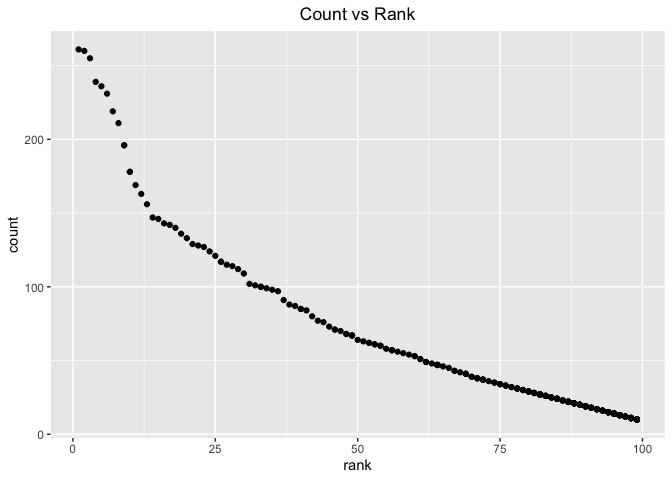

p8105\_hw2\_rs4025
================
Rebecca Silva
10/4/2019

Questions: - best way to print var names? I did names() - do we have to
specify col\_types or can we let R do that - convert month abrrev to
full month - make year as.numeric? - order years in ascending?

## Problem 1

``` r
#read and clean data
data_trash = 
  readxl::read_excel("./data/HealthyHarborWaterWheelTotals2018-7-28.xlsx", 
                          sheet = 1,
                          range = "A2:N38") %>%
  janitor::clean_names() %>%
  filter( dumpster != "NA") %>% 
  mutate( sports_balls = as.integer(
    round(sports_balls)))

data_precip2017 = 
  readxl::read_excel("./data/HealthyHarborWaterWheelTotals2018-7-28.xlsx", 
                          sheet = 4,
                          range = "A2:B14") %>% 
  janitor::clean_names() %>%
  mutate( year = 2017)

data_precip2018 = 
  readxl::read_excel("./data/HealthyHarborWaterWheelTotals2018-7-28.xlsx", 
                          sheet = 3,
                          range = "A2:B14") %>% 
  janitor::clean_names() %>%
  mutate( year = 2018)
```

``` r
# combine 2017 and 2018 data  (join or bind?)
  
data_precip = 
  bind_rows(data_precip2017, data_precip2018) %>%
  janitor::clean_names() %>% 
  mutate( month = str_to_lower( month.name[month] ))
```

``` r
# total precip in 2018
total_precip = 
  data_precip %>%
  filter( year == 2018) %>% 
  summarize( total = sum(total, na.rm = T))

# median number of sports balls in a dumpster in 2017
median = 
  data_trash %>% 
  filter( year == 2017) %>% 
  summarize( median = median(sports_balls, na.rm = T))
```

The data set named ‘data\_trash’ gives information about trash disposal
in specified dumpsters. The data set has 32 observations and 14
variables. Some key variables include the dumpster number, the date the
trash is collected, and how much the trash weighs which are named
dumpster, date, and weight\_tons, respectively. Many of the variables
consist of frequent types of trash collected such as plastic\_bottles,
cigarette\_butts and grocery\_bags.

The data set named ‘data\_precip’ gives information about the
precipitation in 2017 and 2018. There are 24 observations and 3
variables, which are month, total and year.

The total precipitation in 2018 is 23.5 inches. The median number of
sports balls in a dumpster is NA since there is no observation of a
dumpster in 2017 in the data set ‘data\_trash’.

## Problem 2

``` r
# pols data
pols = 
  read_csv("./data/fivethirtyeight_datasets/pols-month.csv") %>% 
  separate(mon, 
           into = c("year", "month", "day"), 
           sep = "-") %>% 
  mutate( month = str_to_lower(month.name[as.numeric(month)]),
          year = as.numeric(year)) %>% 
  pivot_longer(c(prez_gop, prez_dem), 
               names_to = "president", 
               names_prefix = "prez_", 
               values_to = "logical") %>% #what to name?
  select( - day)
```

    ## Parsed with column specification:
    ## cols(
    ##   mon = col_date(format = ""),
    ##   prez_gop = col_double(),
    ##   gov_gop = col_double(),
    ##   sen_gop = col_double(),
    ##   rep_gop = col_double(),
    ##   prez_dem = col_double(),
    ##   gov_dem = col_double(),
    ##   sen_dem = col_double(),
    ##   rep_dem = col_double()
    ## )

``` r
# snp data
snp = 
  read_csv("./data/fivethirtyeight_datasets/snp.csv") %>% 
  separate(date, 
           into = c("month", "day", "year"), 
           sep = "/") %>% 
  mutate( month = str_to_lower(month.name[as.numeric(month)]),
          year = as.numeric(year)) %>% 
  arrange( year, month) %>% 
  select( year, month, close)
```

    ## Parsed with column specification:
    ## cols(
    ##   date = col_character(),
    ##   close = col_double()
    ## )

``` r
# unemployment data 
unemployment = 
  read_csv("./data/fivethirtyeight_datasets/unemployment.csv") %>% 
  janitor::clean_names() %>% 
  rename( january = jan, 
          febuary = feb, 
          march = mar,
          april = apr, 
          june = jun,
          july = jul,
          august = aug, 
          september = sep, 
          october = oct, 
          november = nov, 
          december = dec) %>% 
  pivot_longer(january:december, 
               names_to = "month", 
               values_to = "percent_unemployed") 
```

    ## Parsed with column specification:
    ## cols(
    ##   Year = col_double(),
    ##   Jan = col_double(),
    ##   Feb = col_double(),
    ##   Mar = col_double(),
    ##   Apr = col_double(),
    ##   May = col_double(),
    ##   Jun = col_double(),
    ##   Jul = col_double(),
    ##   Aug = col_double(),
    ##   Sep = col_double(),
    ##   Oct = col_double(),
    ##   Nov = col_double(),
    ##   Dec = col_double()
    ## )

``` r
# join data 

final_join = 
  left_join(
    left_join(pols, snp,  # first join 
              by = c("year", "month")), 
    unemployment, 
    by = c("year", "month"))

# order with key variables first
final_join = 
  final_join %>% 
  select(year, month, president:percent_unemployed, everything() )
```

The ‘pol’ dataset was initially a dataset with 9 variables giving counts
of democratic and republican politicians from 1947 to 2015. The ‘date’
column labeled ‘mon’ became separate variables for year and month and we
condensed two columns which indicate whether a president was a democrat
or republican, labeling ‘president’ as the variable that indicates their
affiliate party and ‘logical’ as the variable representing a ‘1’ for
democrat and ‘0’ for republican. The resulting dataset has 1644
observations of 10 variables.

The ‘snp’ data initially contained 787 observations of two variables:
date, and closing value of S\&P index (labeled ‘close’). We tidied the
date column to contain variables ‘year’ and ‘month’ and arranged the
observations by year and month. The dataset now contains 3 variables and
ranges from 1950 to 2015.

Lastly, the ‘unemployment’ data contained the unemployment percentage
for 69 specified months of years ranging from 1948 to 2015. Each month
was a separate column which we condensed into one named ‘month’ and
added the variable ‘percent\_unemployed’ to contain the values of each
month variable. This resulted in more observations, specifically 816
observations, and only 3 variables.

We merged all three of the above datasets into the dataset
‘final\_join’. The final dataset contains 1644 observations of 12
variables which includes observations from 1947 to 2015. We are most
interested in the variables ‘year’, ‘month’, ‘president’, ‘logical’,
‘close’, and ‘percent\_unemployed’, all previously described. Due to
the nature of joining data, we are left with NA’s, most coming from
specific years when that data might not have been collected.

## Problem 3

``` r
# read in dataset 
baby_names = 
  read_csv("./data/Popular_Baby_Names.csv", 
           col_types = "dcccdd") %>% 
  janitor::clean_names() %>% 
  mutate( gender = str_to_lower(gender), 
          ethnicity = str_to_lower(ethnicity), 
          childs_first_name = str_to_lower(childs_first_name),
          ethnicity = ifelse( 
            ethnicity == "asian and paci" | ethnicity == "asian and pacific islander", 
            "asian and pacific islander", 
                              ifelse( 
                                ethnicity == "black non hisp" | ethnicity == "black non hispanic", 
                                "black non hispanic", 
                                ifelse( 
                                  ethnicity == "white non hisp" | ethnicity == "white non hispanic" , 
                                  "white non hispanic", "hispanic")))) %>% 
  distinct(.keep_all = TRUE) # remove duplicate rows 


#testing = baby_names %>% group_by(year_of_birth, gender, ethnicity, childs_first_name, count, rank)%>% summarize( total = n())
```

Produce a well-structured, reader-friendly table showing the rank in
popularity of the name “Olivia” as a female baby name over time; this
should have rows for ethnicities and columns for year.

``` r
olivia = 
  baby_names %>% 
  filter(childs_first_name == "olivia", gender == "female") %>% 
  pivot_wider(
    names_from = "year_of_birth", 
    values_from = "rank"
  ) %>% 
  select( -c(gender, childs_first_name, count))

knitr::kable(olivia)
```

| ethnicity                  | 2016 | 2015 | 2014 | 2013 | 2012 | 2011 |
| :------------------------- | ---: | ---: | ---: | ---: | ---: | ---: |
| asian and pacific islander |    1 |   NA |   NA |   NA |   NA |   NA |
| black non hispanic         |    8 |   NA |   NA |   NA |   NA |   NA |
| hispanic                   |   13 |   NA |   NA |   NA |   NA |   NA |
| white non hispanic         |    1 |   NA |   NA |   NA |   NA |   NA |
| asian and pacific islander |   NA |    1 |   NA |   NA |   NA |   NA |
| black non hispanic         |   NA |    4 |   NA |   NA |   NA |   NA |
| hispanic                   |   NA |   16 |   NA |   NA |   NA |   NA |
| white non hispanic         |   NA |    1 |   NA |   NA |   NA |   NA |
| asian and pacific islander |   NA |   NA |    1 |   NA |   NA |   NA |
| black non hispanic         |   NA |   NA |    8 |   NA |   NA |   10 |
| hispanic                   |   NA |   NA |   16 |   NA |   NA |   NA |
| white non hispanic         |   NA |   NA |    1 |   NA |   NA |   NA |
| asian and pacific islander |   NA |   NA |   NA |    3 |   NA |   NA |
| black non hispanic         |   NA |   NA |   NA |    6 |   NA |   NA |
| hispanic                   |   NA |   NA |   NA |   22 |   NA |   NA |
| white non hispanic         |   NA |   NA |   NA |    1 |   NA |   NA |
| asian and pacific islander |   NA |   NA |   NA |   NA |    3 |   NA |
| black non hispanic         |   NA |   NA |   NA |   NA |    8 |   NA |
| hispanic                   |   NA |   NA |   NA |   NA |   22 |   NA |
| white non hispanic         |   NA |   NA |   NA |   NA |    4 |   NA |
| asian and pacific islander |   NA |   NA |   NA |   NA |   NA |    4 |
| hispanic                   |   NA |   NA |   NA |   NA |   NA |   18 |
| white non hispanic         |   NA |   NA |   NA |   NA |   NA |    2 |

``` r
##** order years in ascending?
```

Produce a similar table showing the most popular name among male
children over time.

``` r
boy_names = 
  baby_names %>% 
  filter( rank == 1, gender == "male") %>% 
  select( - c(gender, count)) %>% 
  pivot_wider(
    names_from = "year_of_birth", 
    values_from = "rank"
  )

knitr::kable(boy_names)
```

| ethnicity                  | childs\_first\_name | 2016 | 2015 | 2014 | 2013 | 2012 | 2011 |
| :------------------------- | :------------------ | ---: | ---: | ---: | ---: | ---: | ---: |
| asian and pacific islander | ethan               |    1 |   NA |   NA |   NA |   NA |    1 |
| black non hispanic         | noah                |    1 |    1 |   NA |   NA |   NA |   NA |
| hispanic                   | liam                |    1 |    1 |    1 |   NA |   NA |   NA |
| white non hispanic         | joseph              |    1 |   NA |    1 |   NA |    1 |   NA |
| asian and pacific islander | jayden              |   NA |    1 |    1 |    1 |   NA |   NA |
| white non hispanic         | david               |   NA |    1 |   NA |    1 |   NA |   NA |
| black non hispanic         | ethan               |   NA |   NA |    1 |    1 |   NA |   NA |
| hispanic                   | jayden              |   NA |   NA |   NA |    1 |    1 |    1 |
| asian and pacific islander | ryan                |   NA |   NA |   NA |   NA |    1 |   NA |
| black non hispanic         | jayden              |   NA |   NA |   NA |   NA |    1 |    1 |
| white non hispanic         | michael             |   NA |   NA |   NA |   NA |   NA |    1 |

``` r
# show all genders?
```

Finally, for male, white non-hispanic children born in 2016, produce a
scatter plot showing the number of children with a name (y axis) against
the rank in popularity of that name (x axis).

``` r
plot_data = 
  baby_names %>% 
  filter( gender == "male", 
          ethnicity == "white non hispanic",
          year_of_birth == 2016)

ggplot(plot_data, aes(x = rank, y = count)) + 
  geom_point() + 
  ggtitle("Count vs Rank") +
  theme(plot.title = element_text(hjust = 0.5))
```

<!-- -->
